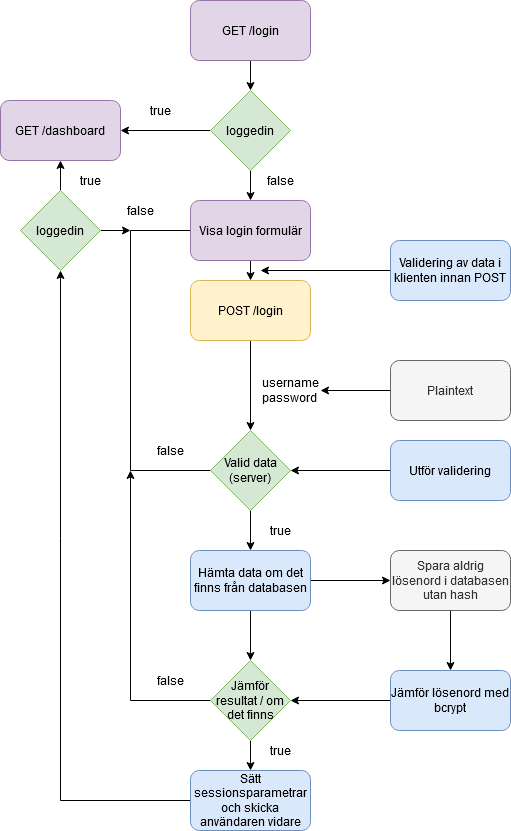

# Del 2 - Planering

**Tid: ~30 min**

Upprätta ett planeringsdokument, planering.md.
Ett tips är att planera på papper och tavlan först. Renskriv sedan och lägg in i planering.md.

Ni ska planera följande.

## Databas

Ni ska först skapa en tabell. Använd skolans databasserver.
Viktigt att ni har ett PREFIX för ert tabellnamn utifrån gruppens namn. Detta för att undvika krockar med andra grupper.

Tabellen för användare ska heta `PREFIXusers` och måste minst innehålla fält för `name` och `password`. Där password är en varchar för att rymma en bcrypt hash av lösenordet.

Vilka fler fält behöver era användare? Vad ska de användas till? Vilka datatyper ska de ha?

## Routes

Ni behöver planera era routes. Vilka routes behövs för att kunna registrera och logga in användare? Hur ska de skrivas, vilka filer.

Fundera på hur varje route ska designas (CRUD), vad ska sidan innehålla (view) och vad ska backend koden innehålla. Gör anteckningar och fundera på applikationens flöde, rita flödesschema över hur ni tänker er att det sker. I hjälpdokumentet i kursboken finns det ett exempel ni kan titta på.
Om ni skriver i text kan det vara:

`Ladda webbroot -> klicka login -> visa formulär -> …`

Sedan kopplar ni detta till routes, views och backend.

Använd er av whiteboard och fota av eventuellt flöde ni ritar.

-   get register
-   post register
-   get login
-   post login

**requires auth**

-   post logout
-   get profile

## Paket

Vilka paket kommer ni att behöva för att kunna köra projektet?

-   bcrypt för att kryptera lösenord
-   databas?
-   dotenv

[Del 3](del3.md)
